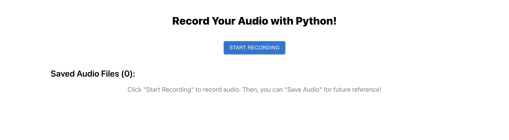
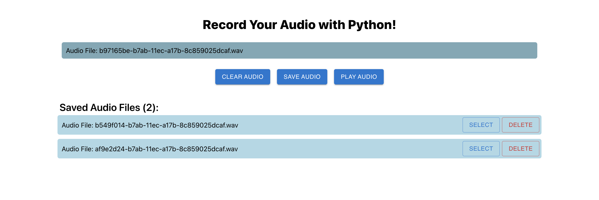

Application: Recording audio with a Flask server

Author: Joaquin Borggio

Date: 4/8/2022

**********************************

**********************************

**********************************

 

**Frontend**:

The frontend of this application is written in React and can be found in the /frontend folder. The majority of the code of interest is in /frontend/src directory.

To boot up frontend:
- run `npm install` within the /frontend folder to install required dependencies
- run `npm start` to start a development application on localhost:3000

You should now be able to access the application on http://localhost:3000

 

**Backend**:

The backend of this application is a Flask (python) server and can be found in the /flask-server folder. Almost all the code of interest can be found inside of app.py.

To boot up backend:
- run `pip install -r requirements.txt` within the /flask-server folder to install required dependencies
- run `flask run` in the terminal to start a development server. This will allow the react application to communicate with the Flask server.

 

Once you boot up both the backend and the frontend, you can use the application on http://localhost:3000 and play around with some audio! You can record audio, save audio files for later use, clear and delete audio files, and play any audio file that you have saved or recently recorded.

 

**Future Development**:

- Moving to remote storage of the audio files would be smart so that we can scale that resource independently without overloading the server's memory
- The current UI is sleek but does not adjust to different size screens or mobile devices. Adding the necessary css styling would not be difficult, but would require some time.
- Due to time contraints, testing was not added. Having tests to make sure frontend components render correctly and tests to make sure backend routes are operating properly would help ensure appropriate behavior.
- Due to time constraints, the current implementation of this application does not relay the audio stream back to the frontend for visualization. In order to accomplish there, you can begin with the commented code in the application that states it is for visualization stream. Code in the frontend (commented) creates an EventSource object which should be able to wait for server-side events and then use the read data as input to an audio visualization tool/component. In the backend (code commented), we need to enable server-side events and then publish data as we are recording. There is initial code for this, but too many bugs came up in the alotted time period to complete this specification. 

Please email jborggio@stanford.edu with any questions.
